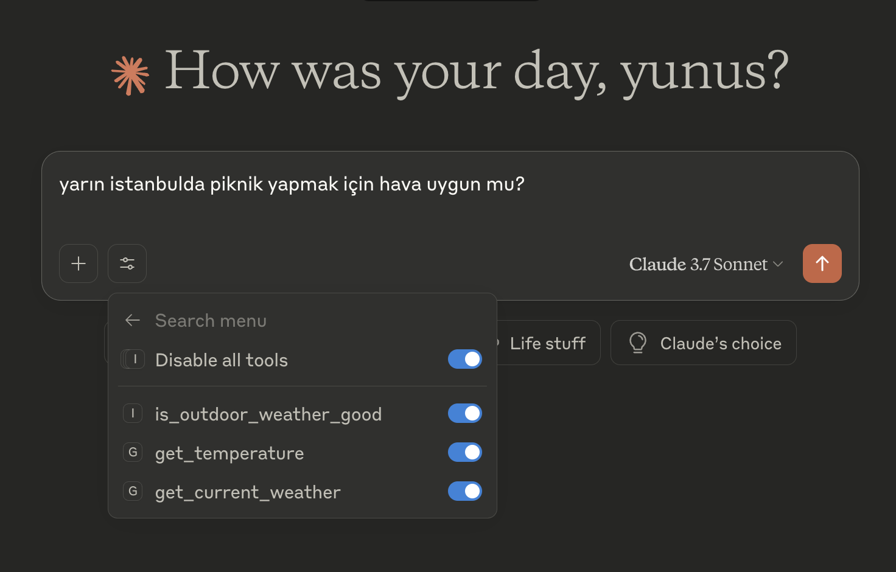
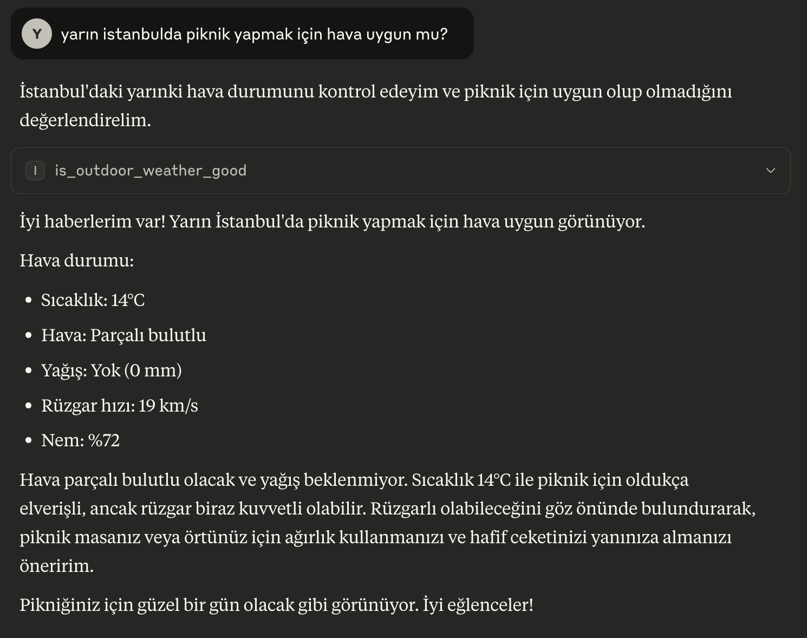

## *claude_desktop_config.json konfigürasyonu*
```json
{
  "mcpServers": {
    "spring-ai-mcp-server": {
      "command": "/Library/Java/JavaVirtualMachines/jdk-21.jdk/Contents/Home/bin/java",
      "args": [
        "-jar",
        "/Users/ynalbant/Desktop/spring-ai-mcp/target/spring-ai-mcp-0.0.1-SNAPSHOT.jar"
      ]
    }
  }
}
```